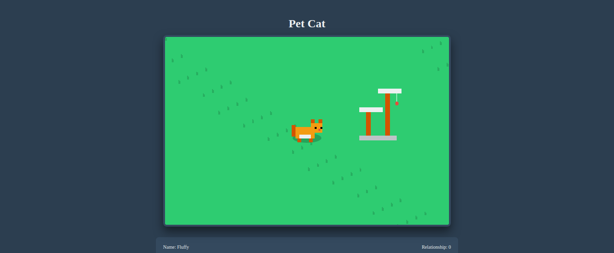
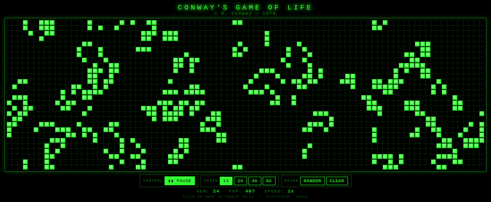
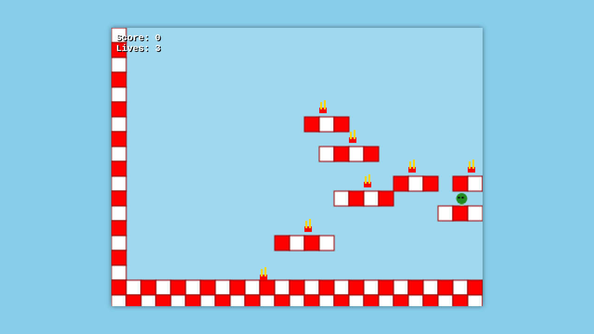
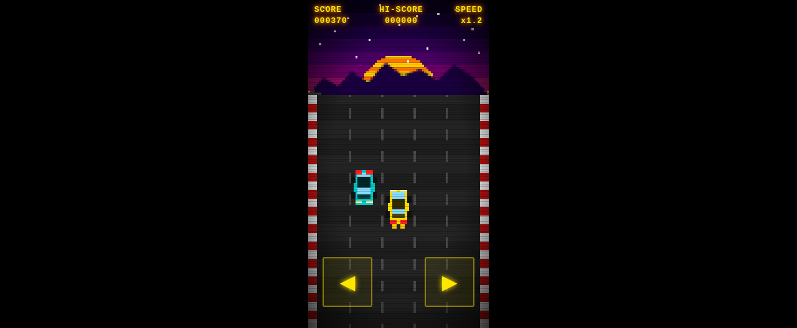
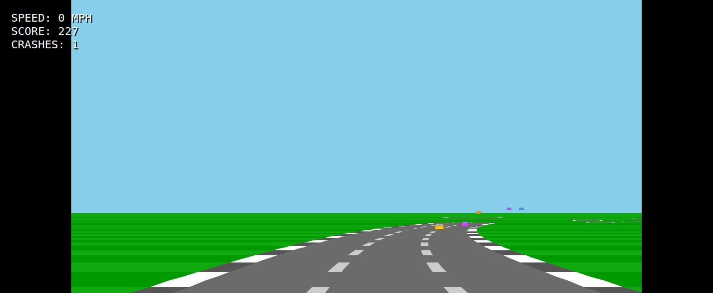
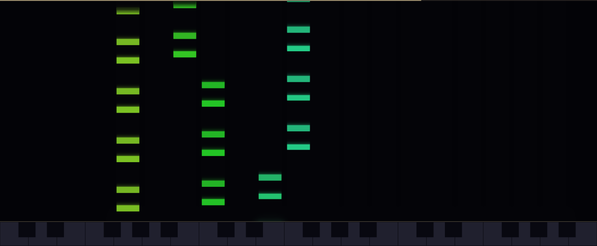
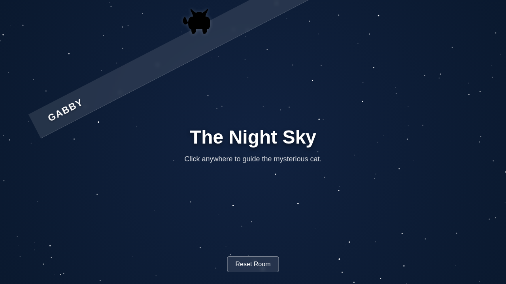

# html-games

A collection of browser-based games built as single HTML files. Each game is self-contained with inline CSS and JavaScript — no frameworks, no build steps.

## Playing the Games

Each game is a standalone `.html` file. Just open it in any modern browser:

```bash
# Clone and open a game
git clone https://github.com/rigrergl/html-games.git
open html-games/games/galaga/galaga.html  # or any game file
```

Or use the GitHub preview links below.

### Current Games

<details>
<summary>Galaga</summary>
<br>

A retro arcade shooter game. This is a complete port of an original canvas-based shooter, fully updated to feature authentic 80s-style pixel art graphics. Defend the galaxy from waves of pixelated alien bugs, bees, and bosses!

[Play Game](https://htmlpreview.github.io/?https://github.com/rigrergl/html-games/blob/main/games/galaga/galaga.html)

<br>


</details>

<details>
<summary>Pet Cat</summary>
<br>

A relaxing, pixel-art style game where you adopt and care for a virtual cat. Brush them to hear them purr, give them treats, and build your relationship over time to unlock new toys like a dangly string and a laser pointer.

[Play Game](https://htmlpreview.github.io/?https://github.com/rigrergl/html-games/blob/main/games/pet-cat/pet-cat.html)

<br>


</details>

<details>
<summary>Scale Explorer</summary>
<br>

Scale Explorer is an educational tool for musicians to visualize and listen to a wide variety of musical scales (Major, Minor, Modes, Pentatonics, Blues, etc.). It features an interactive piano and guitar view where you can see the notes of the scale, play the scale out loud, and play diatonic chords for exploration and practice.

[Play Game](https://htmlpreview.github.io/?https://github.com/rigrergl/html-games/blob/main/games/scale-explorer/scale-explorer.html)

<br>


</details>

<details>
<summary>Conway's Game of Life</summary>
<br>

A faithful implementation of John Conway's classic 1970 cellular automaton, styled as a vintage CRT phosphor terminal. Cells follow the four original rules: underpopulation, survival, overpopulation, and reproduction — on a toroidal grid that wraps at the edges. Click or drag to paint cells, use the speed controls to fast-forward, and watch order emerge from chaos.

[Play Game](https://htmlpreview.github.io/?https://github.com/rigrergl/html-games/blob/main/games/conways-game-of-life/conways-game-of-life.html)

<br>


</details>

<details>
<summary>Burger Run</summary>
<br>

A fast-paced, pixelated platformer where you play as a tasty burger on the run! Avoid angry broccoli heads and collect golden fries as you jump across the diner-themed levels. Use Arrow Keys or WASD to move and jump.

[Play Game](https://htmlpreview.github.io/?https://github.com/rigrergl/html-games/blob/main/games/burger-run/burger-run.html)

<br>


</details>

<details>
<summary>Highway Racer</summary>
<br>

A classic top-down highway driving game. Weave through oncoming traffic as your speed increases over time — dodge as long as you can before a collision ends your run. Use arrow keys / A & D on desktop, or the on-screen buttons on mobile. Swipe left/right also works on touchscreens.

[Play Game](https://htmlpreview.github.io/?https://github.com/rigrergl/html-games/blob/main/games/highway-racer/highway-racer.html)

<br>


</details>

<details>
<summary>Pole Position</summary>
<br>

A pseudo-3D arcade racing game modeled after the classic game "Pole Position". Steer your car along the twisting track and accelerate to achieve the highest score! Supports keyboard and touch controls.

[Play Game](https://htmlpreview.github.io/?https://github.com/rigrergl/html-games/blob/main/games/pole-position/pole-position.html)

<br>


</details>

<details>
<summary>Song Visualizer</summary>
<br>

Hand-authored MIDI-driven music visualizations, running entirely in the browser with no server and no runtime CDN dependencies.

[Play Game](https://htmlpreview.github.io/?https://github.com/rigrergl/html-games/blob/main/games/song-visualizer/songs/bach-format0/index.html)

<br>


</details>

<details>
<summary>Gabby Night Sky</summary>
<br>

An interactive webpage featuring a mysterious cat named Gabby roaming a beautiful, starry night sky. Click or tap to guide Gabby, and watch out—she might be mischievous and knock down the website navigation bar!

[Play Game](https://htmlpreview.github.io/?https://github.com/rigrergl/html-games/blob/main/games/gabby-night-sky/gabby-night-sky.html)

<br>


</details>

## For Claude Code (AI Agent)

**WARNING:** This project is designed to run inside disposable VM environments. The repository is configured to bypass all permission prompts (`bypassPermissions` is enabled by default in `.claude/settings.json`), allowing the agent to execute arbitrary shell commands, modify files, and make network requests without confirmation. **Do not run this on your personal machine or any environment with sensitive data.**
