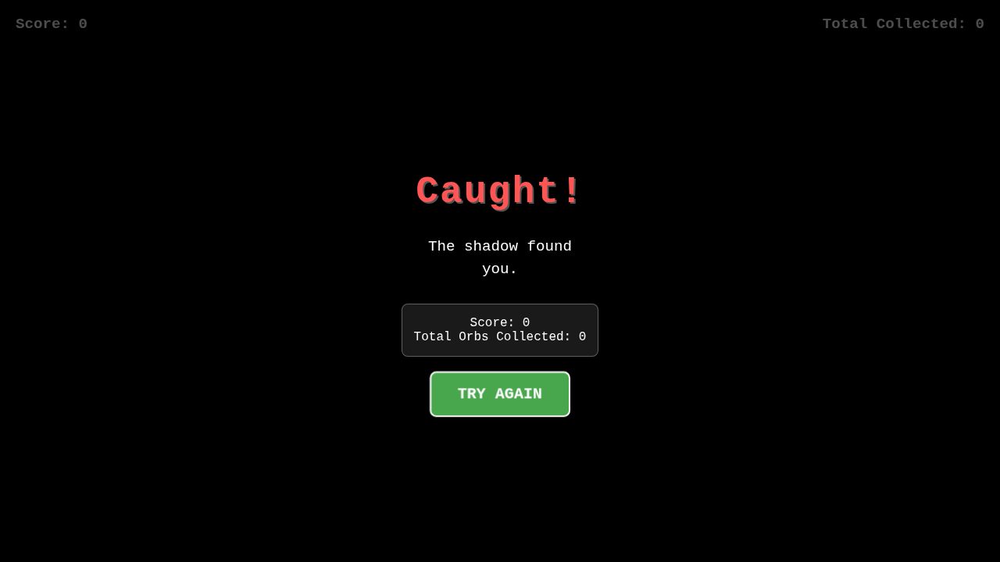

# Hide and Seek

A dark and atmospheric top-down browser game built with HTML5 Canvas. You play as a source of light navigating a dark, procedurally generated map scattered with obstacles. Your objective is to find and collect the wandering glowing orbs while avoiding the shadow hunter that is constantly chasing you.

## Play the Game

[Play Hide and Seek](https://htmlpreview.github.io/?https://github.com/rigrergl/html-games/blob/main/games/hide-and-seek/hide-and-seek.html)

## Controls

*   **Desktop:** Use `W, A, S, D` or `Arrow Keys` to move.
*   **Mobile:** Touch and drag anywhere on the screen to move the player relative to your swipe (this prevents the player from being obscured by your finger).

## Screenshot

