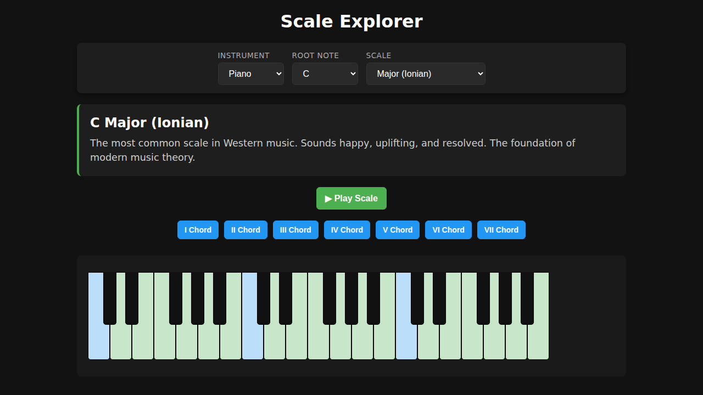

# Scale Explorer

[Play Game](https://htmlpreview.github.io/?https://github.com/rigrergl/html-games/blob/main/games/scale-explorer/scale-explorer.html)

Scale Explorer is an educational tool for musicians to visualize and listen to a wide variety of musical scales (Major, Minor, Modes, Pentatonics, Blues, etc.). It features an interactive piano and guitar view where you can see the notes of the scale, play the scale out loud, and play diatonic chords for exploration and practice.
